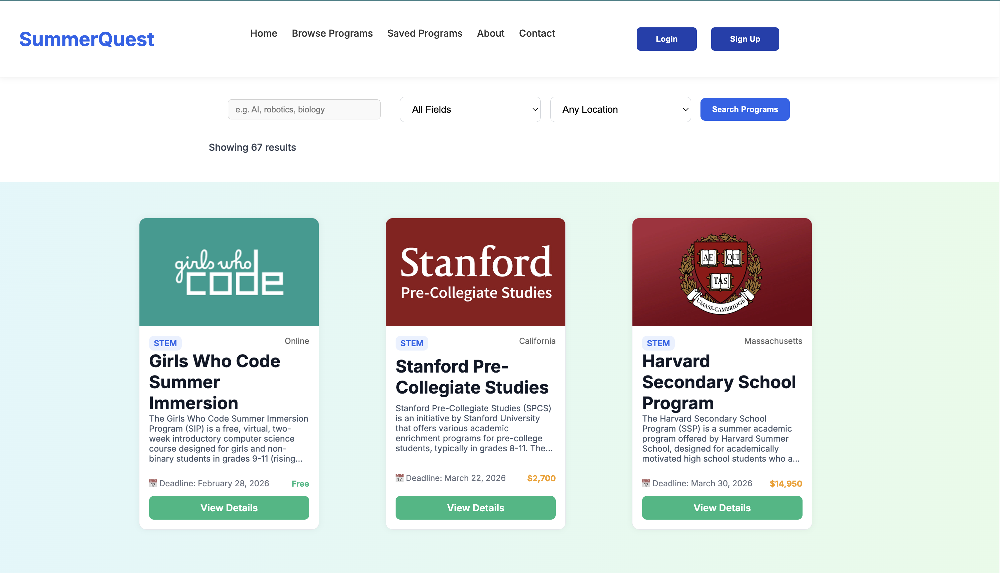

Hi there! 👋 I’m Alcides Manzo, a sophomore at MIT double majoring in Electrical Engineering & Computer Science (6-5) and Mathematics (18).

🔭 I’m currently working on:
Building SummerQuest, a full-stack platform that helps high school students discover and compare academic summer programs. I am building it using React, Node.js, Express, and MySQL, with features like AI-powered program scraping and in the future,personalized recommendations. I’m also developing a website for my fraternity, Zeta Psi, to improve member communication and event management.

**Visit summerquest.net to see the project!**

🌱 I’m currently learning:
Advanced React concepts, backend best practices with Express.js and MySQL, authentication flows including JWT and OAuth. For electrical engineering, I’m expanding into C++ and C for embedded systems, and Altium Designer for PCB design and circuit development.

👯 I’m looking to collaborate on:
Web applications, data-driven projects, and AI-powered tools — especially those that combine backend engineering and machine learning for real-world impact. I’m also interested in hardware-software integration projects.

📫 How to reach me:
Email • LinkedIn • GitHub DMs

